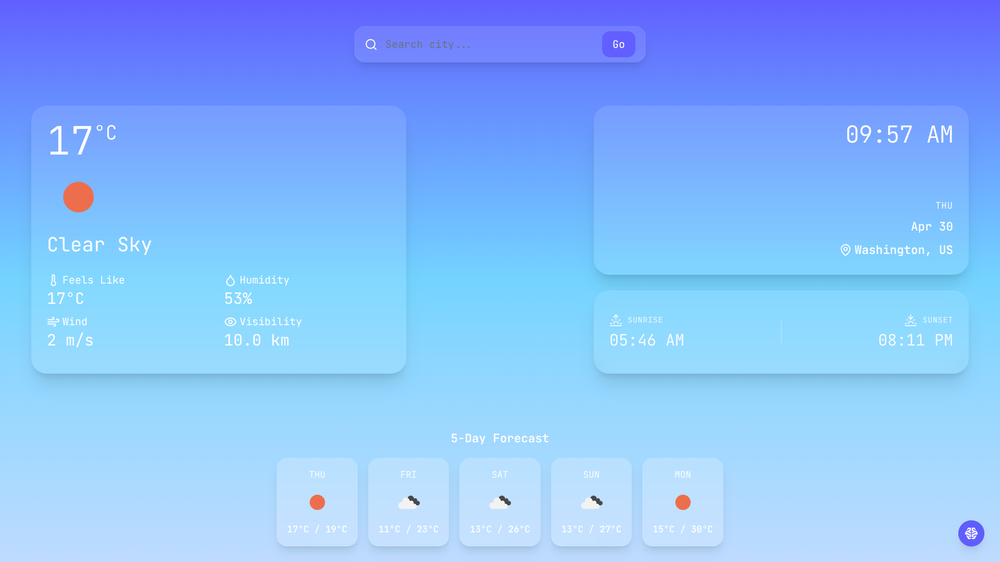
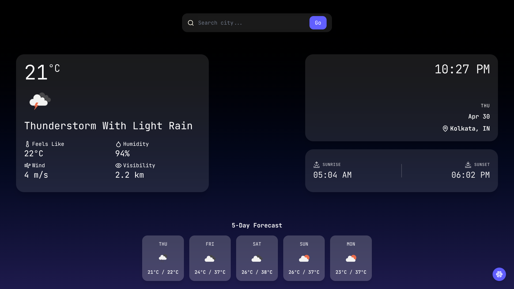

# 🌤️ Weather App

> A modern, responsive weather application built with **React + Vite**, delivering real-time weather data with accurate local time, sunrise/sunset info, dynamic day/night theming, a 5-day forecast, and AI-generated weather tips.

🔗 **Live Demo:** [weather-app-abohawa.vercel.app](https://weather-app-abohawa.vercel.app)

---

## ✨ Features

- **City search** with current temperature, feels-like, humidity, wind speed, and visibility
- **Accurate local time** per searched city, with timezone-aware sunrise & sunset display
- **5-day weather forecast** with daily max & min temperatures
- **Dynamic theming** — background shifts between day and night modes based on sun position
- **AI-powered weather tips** — contextual suggestions generated using the Gemini API
- **Glassmorphism-inspired UI**, fully responsive across all screen sizes

---

## 🧩 Backend

This project uses a separate backend service for handling API requests and AI processing.

**Repository:** [github.com/arkaman/weather-ai-service](https://github.com/arkaman/weather-ai-service)

---

## 🛠️ Tech Stack

| Technology      | Purpose                                   |
| --------------- | ----------------------------------------- |
| React 19        | UI & component architecture               |
| Vite            | Fast dev server & build tooling           |
| Tailwind CSS    | Utility-first styling & responsive design |
| Lucide Icons    | Lightweight, consistent iconography       |
| OpenWeather API | Real-time weather & forecast data         |
| Gemini API      | AI-generated weather tips & insights      |

---

## 📸 Screenshots

| Day Mode                           | Night Mode                             |
| ---------------------------------- | -------------------------------------- |
|  |  |
